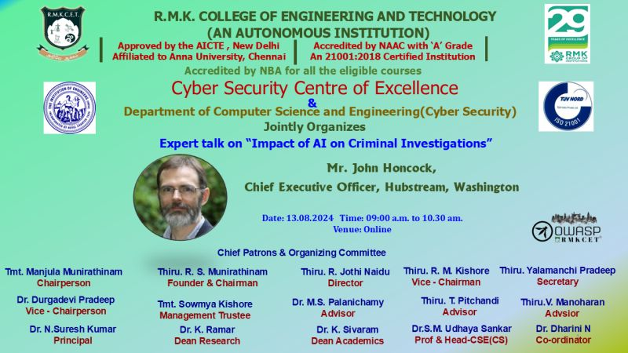
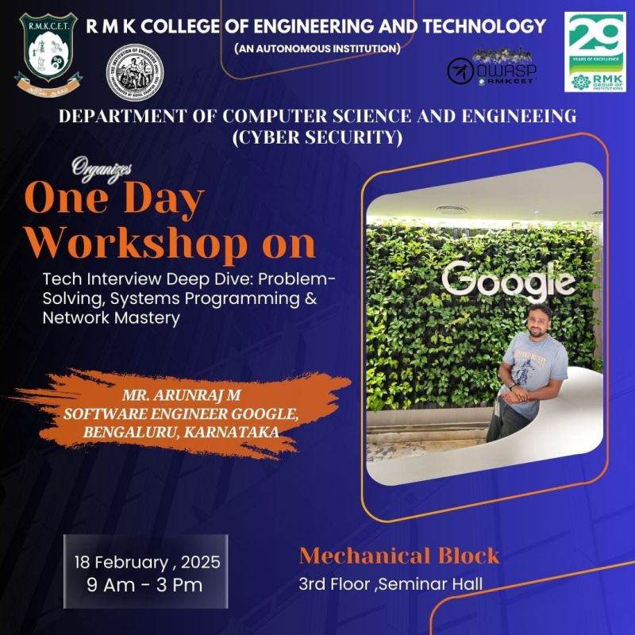
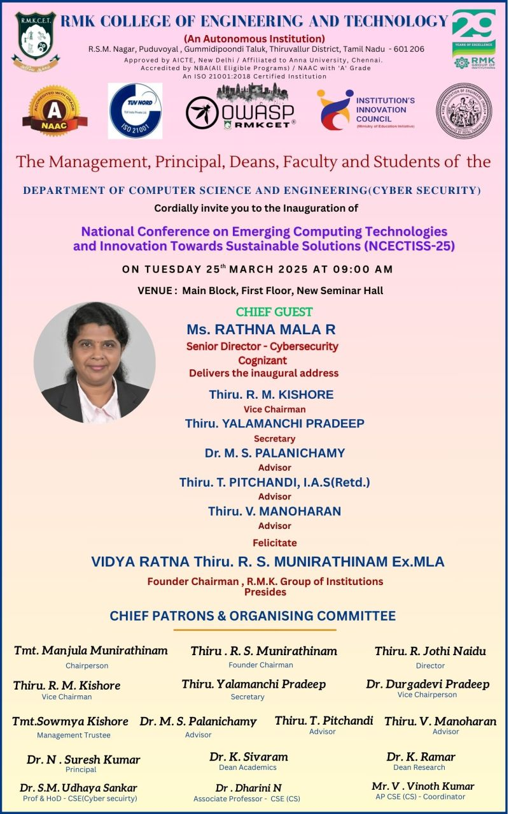

---

layout: col-sidebar
title: OWASP RMK College of Engineering and Technology
tags: OWASP RMKCET
region: Asia
country: India
meetup-group: owasp-rmk-college-of-engineering-and-tech

---

## Welcome

RMK College of Engineering and Technology, Department Of Cyber Security proudly established its cybersecurity chapter in October 2023. A dynamic group of college enthusiasts, are dedicated to raising Cyber Awareness and honing cybersecurity skills for our fellow students at RMKCET! The chapter extends exciting opportunities to the software community for active participation in ensuring secure application development. Anticipate engaging events focused on Web/App Security, Penetration Testing, Bug Bounty, Ethical Hacking, and much more! Join forces with us to enhance cybersecurity and make the digital realm a safer space!

## Participation
The Open Worldwide Application Security Project (OWASP) is a nonprofit foundation that works to improve the security of software. All of our projects, tools, documents, forums, and chapters are free and open to anyone interested in improving application security. 

Chapters are led by local leaders in accordance with the [Chapters Policy](/www-policy/operational/chapters). Financial contributions should only be made online using the authorized online donation button. 

Everyone is welcome and encouraged to participate in our [Projects](/projects/), [Local Chapters](/chapters/), [Events](/events/), [Online Groups](https://groups.google.com/a/owasp.com/){:target='_blank'}, and [Community Slack Channel](https://owasp.slack.com/){:target='_blank'}. We especially encourage diversity in all our initiatives. OWASP is a fantastic place to learn about application security, to network, and even to build your reputation as an expert. We also encourage you to be [become a member](/membership/) or consider a [donation](/donate/) to support our ongoing work.

## Speaker request
If you like to speak on our upcoming events, Kindly mail us
* [Aswanth Babu](mailto:aswanth.babu@owasp.org)
* [Kishan Jai Soorya N](mailto:kishan.soorya@owasp.org)

**Email Format :**

- Speaker name
- Job Role
- Company / Organization
- Country.
- Email ID
- Contact Number
- Speaker Profile
- Presentation Details
    - Name / Title of the Presentation
    - Abstract of the presentation
    - Presentation time required

Next Meeting/Event 
---------------------
## Occured Events:  

1.<b>Innovative Application of Linux in Cyber Security Explored: Industry Perspective on Hacking Techniques</b>  
When :NOVEMBER 10 2023 || 10:30 AM - 12:30 PM  
Mode :Online  
 
 

2.<b>An Expect Talk on Innovating Security : Cutting-Edge Approaches to Coding Safely</b>  
When :JANUARY 23 2024 || 10:00 AM - 11:00 AM  
Mode :Online  
 
 

3.<b>InnovateSecure: Exploring Cyber Security Innovations in a Hands-on Workshop</b>  
When :FEBRUARY 17 2024 || 09:30 AM - 03:05 PM  
Mode :Offline  
 
 

4.<b>Impact of AI on Criminal Investigations</b>  
When :AUGUST 13 2024 || 09:00 AM - 10:30 AM  
Mode :Online  
 
 

5.<b>Common Web Vulnerabilities</b>  
When :SEPTEMBER 25 2024 || 10:30 AM - 12:00 PM  
Mode :Offline  
 
 

6.<b>𝗧𝗲𝗰𝗵 𝗜𝗻𝘁𝗲𝗿𝘃𝗶𝗲𝘄 𝗗𝗲𝗲𝗽 𝗗𝗶𝘃𝗲: 𝗣𝗿𝗼𝗯𝗹𝗲𝗺-𝗦𝗼𝗹𝘃𝗶𝗻𝗴, 𝗦𝘆𝘀𝘁𝗲𝗺𝘀 𝗣𝗿𝗼𝗴𝗿𝗮𝗺𝗺𝗶𝗻𝗴 & 𝗡𝗲𝘁𝘄𝗼𝗿𝗸 𝗠𝗮𝘀𝘁𝗲𝗿𝘆</b>  
When :FEBRUARY 18 2025 || 09:30 AM - 03:05 PM  
Mode :Offline  
 
 

7.<b>National Conference on Emerging Computing Technologies and Innovation Towards Sustainable Solutions (NCECTISS-25)</b>  
When :MARCH 25 2025 || 09:00 AM - 03:05 PM  
Mode :Offline  
 
 

## Upcoming Events:  
 
<b> Coming Soon..... <b>

